# DSO101 Assignment I - CI/CD Pipeline

**Student Name:** UgayNobu  
**Student ID:** 02240369  
**Course:** DSO101 - Continuous Integration and Continuous Deployment  

---

## Part A: Deploying a Pre-Built Docker Image to Docker Hub Registry

### Overview
In Part A, the backend and frontend Docker images were built locally and pushed to Docker Hub. The images were then deployed on Render.com using the "Existing Image from Docker Hub" option.

---

### Step 1: Login to Docker Hub
```bash
docker login
```

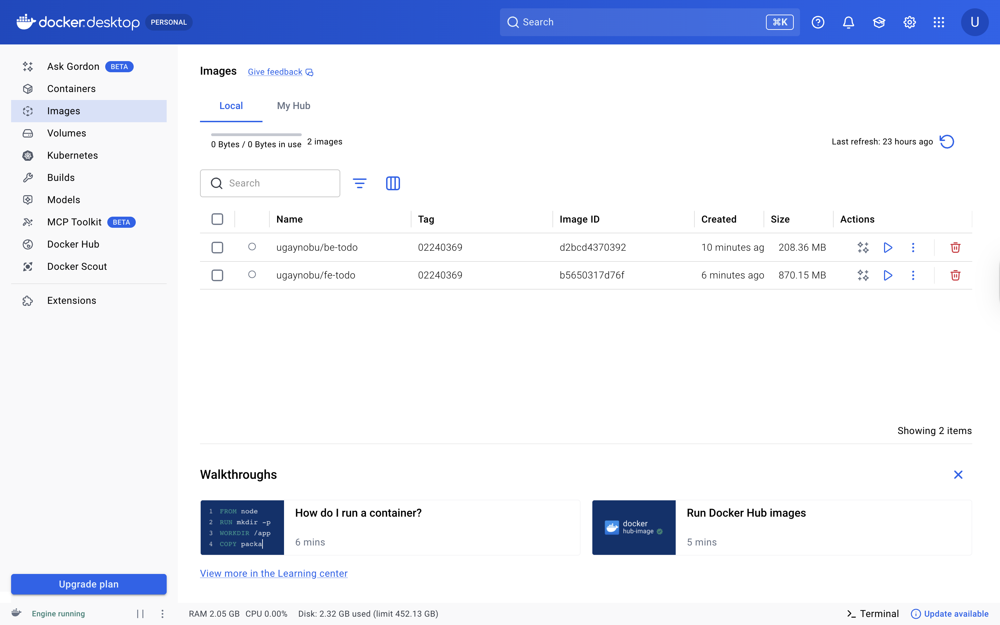

---

### Step 2: Build and Push Backend Image
```bash
docker buildx build --platform linux/amd64 -t ugaynobu/be-todo:02240369 --push --provenance=false --sbom=false .
```

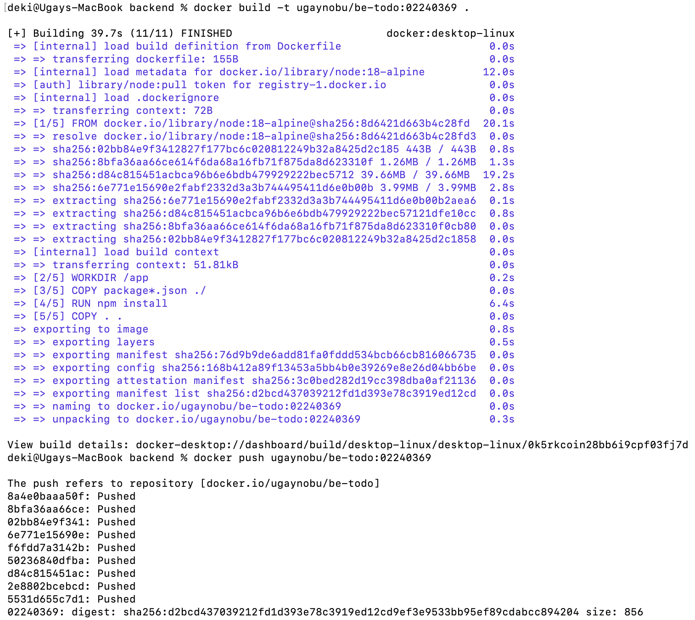

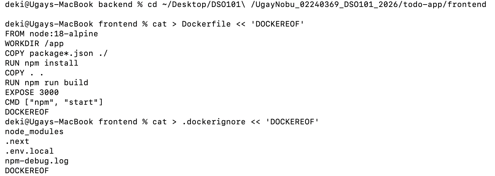

---

### Step 3: Build and Push Frontend Image
```bash
docker buildx build --platform linux/amd64 -t ugaynobu/fe-todo:02240369 --push --provenance=false --sbom=false .
```

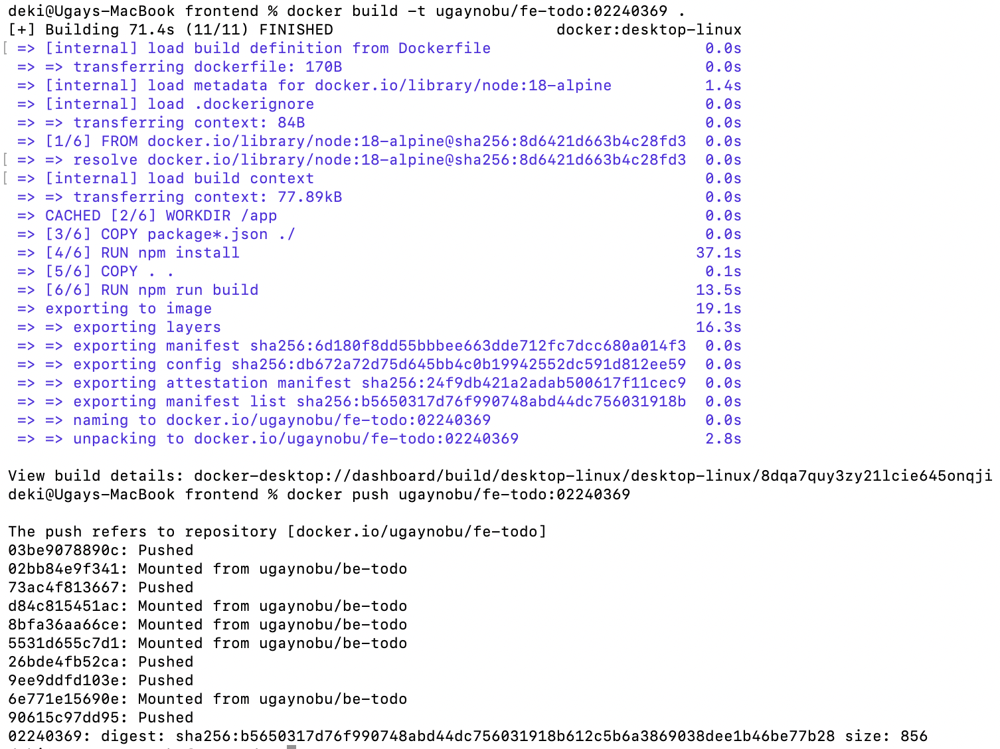

---

### Step 4: Verify Images on Docker Hub

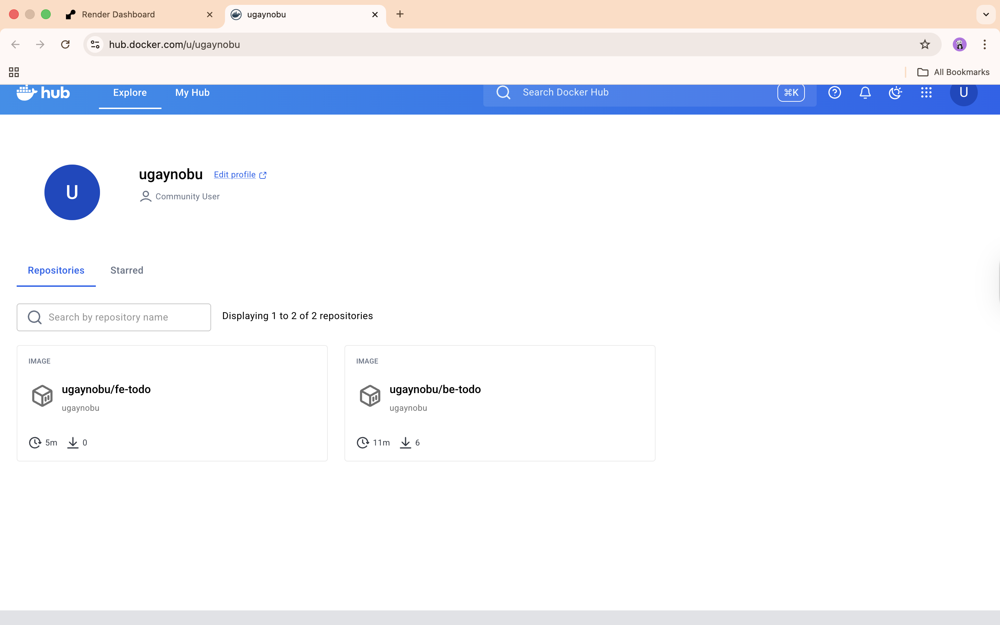

---

### Step 5: Create PostgreSQL Database on Render

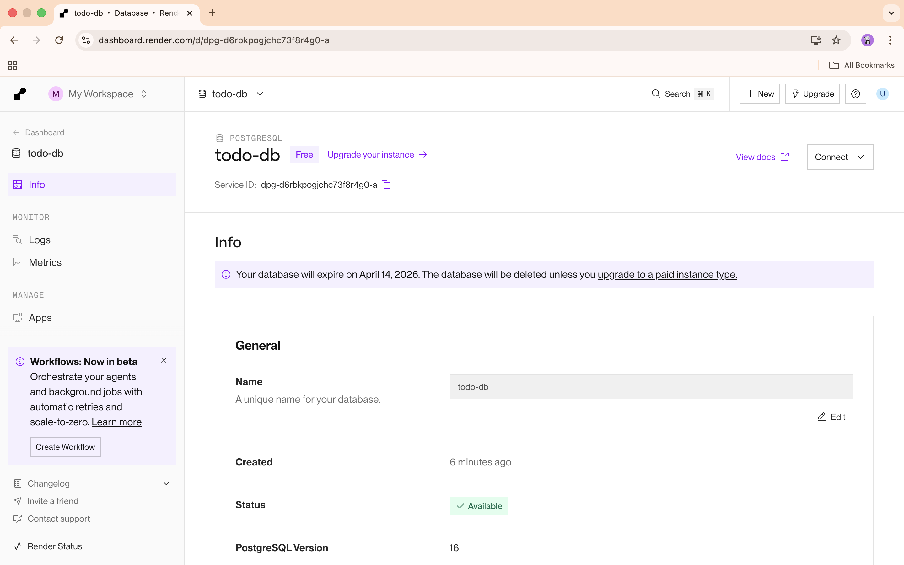

---

### Step 6: Deploy Backend on Render

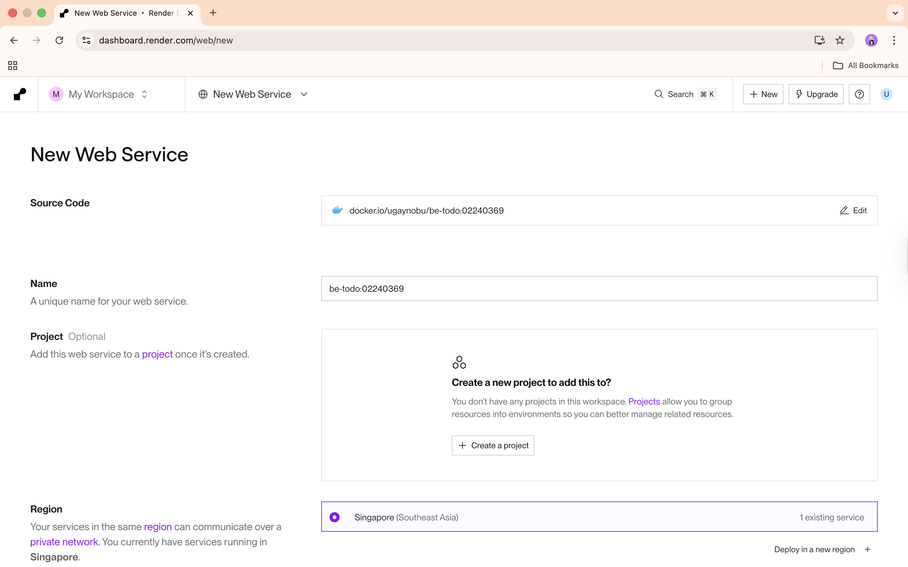

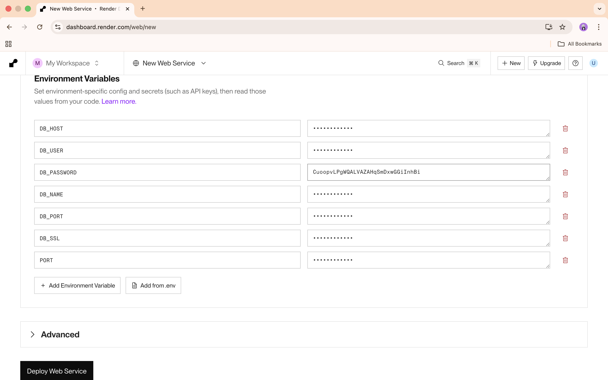

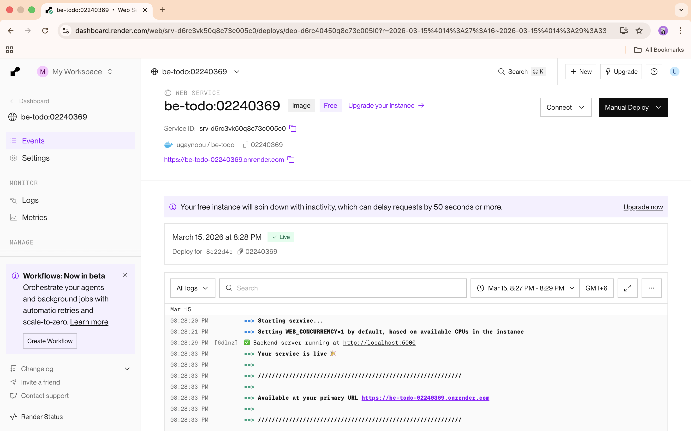

**Backend URL:** https://be-todo-02240369.onrender.com

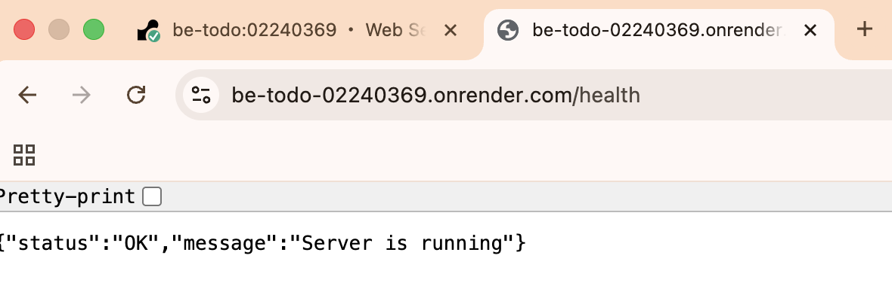

---

### Step 7: Deploy Frontend on Render

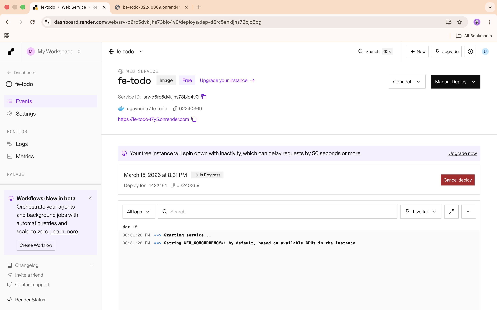

**Frontend URL:** https://fe-todo-t7y5.onrender.com

---

## Part B: Automated Image Build and Deployment

### Overview
In Part B, Render was configured to automatically build and deploy a new Docker image every time a new commit is pushed to GitHub, using a render.yaml Blueprint file.

---

### Step 1: Create render.yaml Blueprint
```yaml
services:
  - type: web
    name: be-todo-github
    runtime: docker
    branch: main
    dockerfilePath: ./todo-app/backend/Dockerfile
    dockerContext: ./todo-app/backend
    region: singapore
    plan: free
    envVars:
      - key: DB_HOST
        value: dpg-d6rbkpogjchc73f8r4g0-a
      - key: DB_USER
        value: todo_db_tx5b_user
      - key: DB_NAME
        value: todo_db_tx5b
      - key: DB_PORT
        value: "5432"
      - key: DB_SSL
        value: "true"
      - key: PORT
        value: "5000"
  - type: web
    name: fe-todo-github
    runtime: docker
    branch: main
    dockerfilePath: ./todo-app/frontend/Dockerfile
    dockerContext: ./todo-app/frontend
    region: singapore
    plan: free
    envVars:
      - key: NEXT_PUBLIC_API_URL
        value: https://be-todo-github.onrender.com
```

---

### Step 2: Push to GitHub
```bash
git add .
git commit -m "Part B: Add render.yaml and env.production files"
git push origin main
```

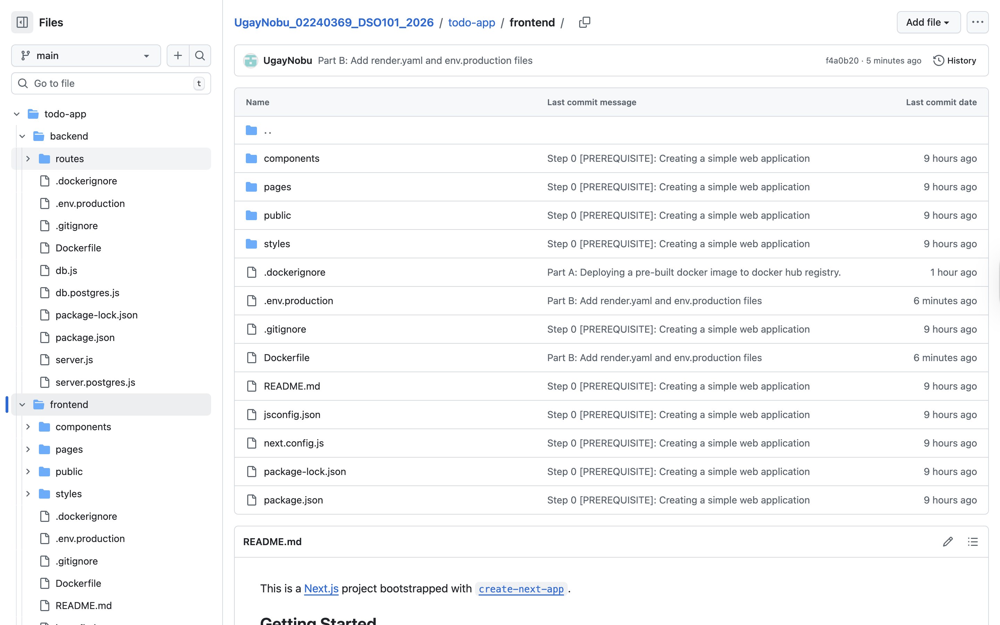

---

### Step 3: Create Render Blueprint

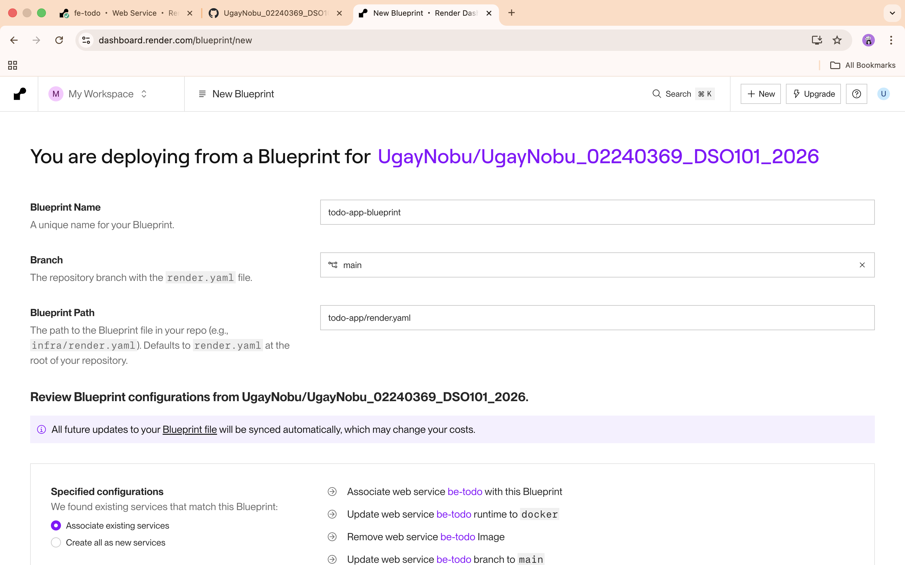

---

### Step 4: Blueprint Sync and Deploy

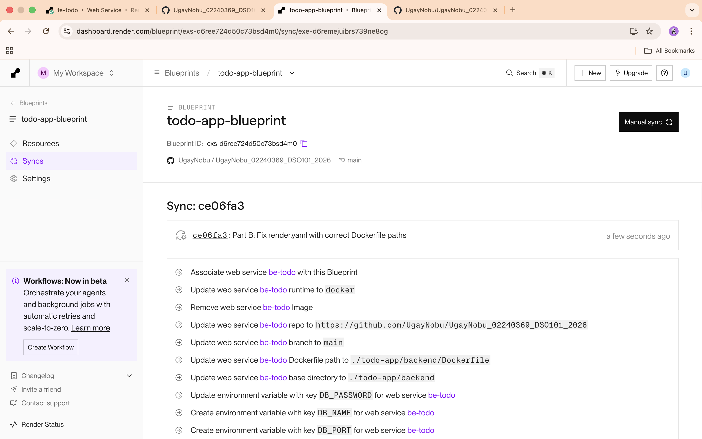

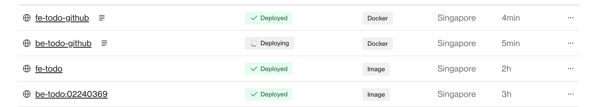

---

### Part B Result

| Feature | Status |
|---------|--------|
| GitHub to Render auto-deploy | Working |
| render.yaml Blueprint | Configured |
| Backend auto-build from Dockerfile | Working |
| Frontend auto-build from Dockerfile | Working |
| New deploy on every git push | Confirmed |

---

## Live URLs

| Service | URL |
|---------|-----|
| Backend (Part A) | https://be-todo-02240369.onrender.com |
| Frontend (Part A) | https://fe-todo-t7y5.onrender.com |
| Backend (Part B) | https://be-todo-github.onrender.com |
| Frontend (Part B) | https://fe-todo-github.onrender.com |

---

## References

- [Docker Documentation](https://docs.docker.com/)
- [Render Documentation](https://render.com/docs)
- [Render Blueprint Spec](https://render.com/docs/blueprint-spec)
- [Render Deploy from Image](https://render.com/docs/deploying-an-image)
- [Render Environment Variables](https://render.com/docs/configure-environment-variables)
